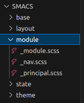

# [PRACTICA]|SASS|BEM|SMACS

## ¿QUE  ES SASS?
Es un lenguaje de programacion al que se le denomina preprocesador, permite escribir codigo y compilarlo a codigo css.
## Características

 - Estructura modular, pero todo se compila en un solo anrchivo scss.
 - Administracion de estilos en variables.
 - Ecalalabilidad(reutilizacion de componentes)
```bash
  .head {
}
.nav {
  &__item {
  }
  &__link {
    &--active {
    }
  }
  &__list {
  }
}
```

## ¿QUE ES BEM?
Metodologia que permite asignar clases de manera ordenada y jerárquica a nuestros elementos html .
El objetivo final de BEM es dividir la interfaz de usuario en bloques independientes para crear componentes escalables y reutilizables. 

## Características
 - Usa un selector único para cada regla
 - Las convenciones a la hora de nombrar las clases permiten tener un control absoluto al saber a qué, quién y hacia dónde hacemos referencia dentro de una estructura.
 - Es posible reciclar ciertas áreas de código desde un proyecto hacia otro.
 
```bash
  <header class="head">
        <nav class="nav">
            <ul class="nav__list">
            <li class="nav__item"><a class="nav__link nav__link--active" href="index.html">INICIO</a></li>
            <li class="nav__item"><a class="nav__link"href="nosotros.html">NOSOTROS</a></li>
            <li class="nav__item"><a class="nav__link"href="contacto.html">CONTACTO</a></li>
            <li class="nav__item"><a class="nav__link"href="servicios.html">SERVICIOS</a></li>
           </ul>
        </nav>
    </header>
```

## ¿QUE ES SMACSS?
(Arquitectura escalable y modular para CSS). Es una guia de estilos, que permite la ORGANIZACION del proyecto.
## Categorizacion de reglas.
El núcleo de SMACSS es la categorización. Al categorizar las reglas CSS, comenzamos a ver patrones y podemos definir mejores prácticas en torno a cada uno de estos patrones.

Hay cinco tipos de categorías:

- Base
- Layout
- Module
- State
- Theme


## PROYECTO CREACION DE PAGINAS WEB USANDO SASS | BEM | SMACSS

# Descripcion del proyecto
Es una pagina que corresponde  a una tienda virtual basica, con sus repectivos elementos.
Incluye la practica de lo mensionado anteriormente.


# Creacion de archivos


Creacion archivos .html


creacion de categorias SMACSS



# Resultados

